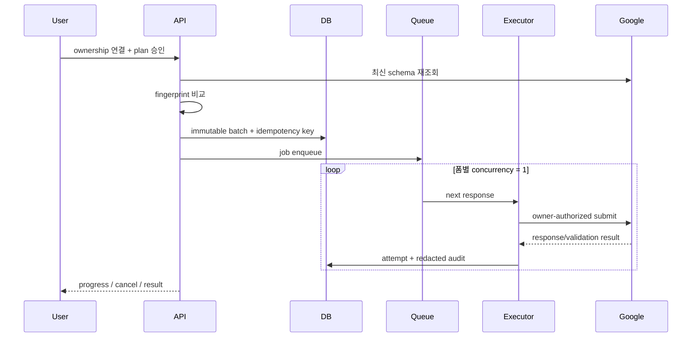

# FormSwarm 기술 설계

상태: MVP 구현 완료 / 제출 실행기는 설계만 완료
기준일: 2026-07-18

## 1. 결론

첫 버전은 마이크로서비스가 아니라 **Cloudflare 호환 TypeScript 모듈형 모놀리스**가 적합하다.
파싱과 생성은 계산량이 작고 한 제품 흐름에 강하게 결합되어 있어, 지금부터 서비스별 배포와
네트워크 경계를 만들면 운영 비용만 늘어난다. 반면 Google Forms 내부 포맷은 변동성이 크므로
Google 전용 코드는 어댑터 경계 안에 격리한다.

채택 스택:

| 영역 | 선택 | 이유 |
|---|---|---|
| UI/BFF | Next.js 16 App Router, React 19 | 서버 fetch와 상호작용 UI를 한 타입 시스템에서 운영 |
| Runtime | vinext, Vite 8, Cloudflare Workers | 서버 측 외부 fetch, 빠른 배포, Web API 기반 코드 |
| 언어/검증 | TypeScript 5.9, Zod | 내부 배열 payload를 신뢰하지 않고 런타임 경계 검증 |
| 생성 | 순수 TypeScript seeded PRNG | 같은 seed가 같은 결과를 만들어 재현·감사가 쉬움 |
| 테스트 | Vitest + SSR render test + opt-in live GET smoke | 순수 도메인 테스트와 실제 포맷 변동 감시를 분리 |
| 영속화(다음 단계) | D1 또는 PostgreSQL | plan, immutable batch, ownership proof, audit log 저장 |
| 작업 실행(다음 단계) | Queue + form-keyed single-flight lock | 폼별 순차 실행, 취소, backoff, idempotency |

공식 Google Forms REST API는 폼 생성/조회/수정과 응답 조회만 제공하며 **응답 생성 메서드는 없다**.
따라서 공개 응답 페이지를 임의로 POST하는 기능을 안정적인 공식 API처럼 취급하면 안 된다.
[Forms REST reference](https://developers.google.com/workspace/forms/api/reference/rest)

소유자가 연결된 모드에서는 Google Apps Script의 `Form.createResponse()` 및
`FormResponse.submit()`이 공식 실행 경로다. 제품화하려면 사용자가 설치/승인한 Apps Script
실행 프로젝트 또는 Workspace add-on 경계가 필요하다.
[Apps Script FormResponse.submit](https://developers.google.com/apps-script/reference/forms/form-response#submit)

## 2. 현재 구현

```mermaid
flowchart LR
  U["Browser workbench"] --> R["POST /api/forms/import"]
  R --> P["URL allowlist + redirect policy"]
  P --> F["Bounded server fetch"]
  F --> E["FB_PUBLIC_LOAD_DATA extractor"]
  E --> M["Normalized FormSchema"]
  M --> G["Rule factory + seeded generator"]
  G --> V["Validated immutable preview in browser memory"]
  V --> J["Complete plan JSON export"]
```



내보낸 JSON은 정규화된 전체 `ImportedForm`, 사용자가 편집한 생성 규칙, seed, 생성 응답,
검증 요약을 한 묶음으로 보존한다. 따라서 question ID와 `entryIds`, grid row binding,
parser version, 진단 정보를 잃지 않으며 동일한 입력으로 결과를 재현할 수 있다.
검증 요약은 발견한 오류와 경고를 기록하는 근거이며, 구조만으로 알 수 없는 문항 간
의미 제약까지 자동으로 보증한다는 뜻은 아니다.

### 모듈 경계

```text
app/
  api/forms/import/route.ts       HTTP/Zod 경계
  components/workbench.tsx       편집·생성·검토 UI
lib/
  domain/form-schema.ts           외부 포맷과 무관한 IR
  application/import-google-form.ts
  adapters/google-forms/
    url-policy.ts                 SSRF allowlist
    fetcher.ts                    timeout/redirect/size/content-type
    parser.ts                     positional payload → IR
  generator/
    rules.ts                      유형별 기본 규칙
    engine.ts                     결정론적 생성
    validation.ts                 필수 응답·허용 구조/선택지 검증
tests/
  google-forms-parser.test.ts     adapter golden fixture
  generator.test.ts               생성 불변식
  live-google-forms.test.ts       제공된 두 폼 GET smoke
  rendered-html.test.mjs          SSR 제품 화면
```

의존성 방향은 `UI → generator·domain`, `API → application → Google adapter → domain`이다.
domain은 Google/Next/Cloudflare를 import하지 않으며, 내부 type code나 배열 index는
`google-forms/parser.ts` 밖으로 나오지 않는다.

## 3. 정규화 모델

`ImportedForm`은 다음을 보존한다.

- `schemaVersion`, `parserVersion`
- 요청 URL, 정규 URL, 공개 responder ID, fetch 시각
- 표시 제목과 설명
- 빈 표지 페이지까지 포함한 `sections[]`
- 순서가 보장된 `questions[]`
- question item ID와 모든 `entryIds[]`
- discriminated type: `short_text | paragraph | single_choice | dropdown | checkboxes |
  scale | grid_single | rating | date | time | unknown`
- 선택지 value/label/Other, required, scale label, grid axes
- 진단 warning과 미지원 문항 수

현재 관찰한 공개 HTML 위치는 다음과 같다. 이는 공식 계약이 아니므로 adapter 내부 상수로만 다룬다.

| 의미 | 관찰 위치 |
|---|---|
| 표시 제목 | `data[1][8]` |
| 설명 | `data[1][0]` |
| item 목록 | `data[1][1]` |
| item ID/title/description/type/fields | `item[0..4]` |
| entry ID/options/required | `field[0..2]` |
| Other | `option[4] === 1` 및 빈 option value |
| page break | type `8` |
| rating | type `18` |

HTML의 rich title은 렌더하지 않고 plain value만 사용한다. 이 선택은 외부 HTML 주입을 차단한다.

## 4. 생성 규칙

현재 규칙은 구조만으로 확정 가능한 기본값이다.

- 단답/장문: 사용자 편집 가능한 샘플 풀, 무작위 또는 순환
- 객관식/척도/별점: 균등, 중앙값 중심, 고정값
- 체크박스: 최소~최대 선택 개수, Other는 기본 자동 생성에서 제외
- 그리드: 각 raw row entry별 균등 또는 중앙 열 중심 선택
- unknown/date/time: 지원이 확인되기 전 해당 문항의 자동 생성을 제외하고 진단에 표시
- batch: 1~500, seed 기반 재현

구조만으로 의미를 확정해서는 안 된다. 예를 들어 제공된 두 번째 폼의 `5-1`, `6-1`은 선행
응답에 따라 작성해야 하고, “특별히 없다/잘 모르겠다”는 다른 체크와 상호배타일 수 있으며,
개인정보 비동의 시 전화번호가 비어야 한다. 다음 단계에서는 이를 별도 rule graph로 표현한다.

```ts
type Constraint =
  | { kind: "visible_when"; questionId: string; predicate: Predicate }
  | { kind: "exclusive_options"; questionId: string; optionValues: string[] }
  | { kind: "clear_when"; questionId: string; predicate: Predicate }
  | { kind: "requires"; questionId: string; predicate: Predicate };
```

heuristic은 “추천”만 만들고 사용자가 승인해야 plan에 포함된다.

## 5. 제출 아키텍처

### 지원 모드

| 모드 | 스키마 | 제출 | 기본 상태 |
|---|---|---|---|
| Public analysis | 공개 HTML adapter | 없음 | 현재 활성 |
| Owner QA | OAuth Forms API | 사용자 승인 Apps Script executor | 다음 단계 |
| Experimental web adapter(향후 연구) | 공개 HTML | 비공식 `formResponse` | 미구현, 전용 disposable form에서만 검토 |

실제 운영 제출은 Owner QA 모드만 제품 경로로 권장한다. 공개 링크를 안다는 사실은 자동화 제출
권한을 의미하지 않는다.

### 목표 흐름



상태 전이는 `draft → previewed → approved → queued → running → completed | partial | failed | cancelled`로
제한한다. `approved` 이후에는 rule이나 response payload를 수정하지 않고 새 batch를 만든다.

필수 운영 속성:

- 폼별 concurrency 1, 전역 rate limit, jitter 포함 exponential backoff
- job/response idempotency key와 attempt audit
- 시작 직전 schema fingerprint 재검사; 변경 시 재승인
- cancel과 partial resume, 최대 batch cap
- 실제 응답 원문은 최소 보존, 연락처/이메일은 로그에서 redaction
- HTTP 200만으로 성공 판정하지 않고 공식 executor 결과 또는 확인 fingerprint 확인

## 6. 위협 모델과 안전장치

### 이미 구현

- `https`만 허용
- host allowlist: `docs.google.com`, redirect 진입용 `forms.gle`
- userinfo/query/hash 제거, 비기본 port 차단, redirect마다 host/path 재검증
- import request body 4 KiB 상한, 전체 fetch chain 10초 deadline, HTML content-type,
  response 2 MiB 상한, redirect 4회 상한
- 해석할 수 없는 payload는 import 중단; 지원 type이라도 entry/options/grid 불변식이 깨지거나
  entry ID가 중복되면 관련 문항을 `unknown`으로 격하해 생성 제외
- 서버가 받은 rich HTML을 클라이언트에 주입하지 않음
- dry-run 기본, 제출 UI 비활성, batch 500 상한
- CAPTCHA/로그인/file upload 우회 코드 없음

### 제출 단계 전에 필수

- OAuth identity와 form owner/editor 권한 확인
- workspace 또는 명시 allowlist
- 사용자별/form별 quota와 abuse anomaly detection
- Terms/robots 및 조직 정책 준수 검토
- 개인정보 보존기간, 삭제 요청, encryption-at-rest 정책
- 전용 QA form과 운영 form을 분리하는 environment guard

## 7. 테스트 증거

두 제공 URL에 대해 실제 POST 없이 GET/파싱만 수행했다.

| fixture | 결과 |
|---|---|
| 신입 사원 온보딩 경험 평가 | 3페이지, 9문항, entry 13개, grid/scale/rating 포함, required 0 |
| AI 기반 손글씨 폰트 생성 서비스 설문 조사 | 표지 포함 6페이지, 13문항, required 8, radio 6, checkbox 5, Other 포함 |

테스트 계층:

1. synthetic fixture: 문자열 내부 bracket을 포함한 marker 추출, marker 누락, Other, scale, grid, rating, unknown type
2. generator invariant/validation: seed 재현, 허용 선택지, required 최소 선택, batch cap,
   필수 응답 누락과 스키마 밖 응답 탐지
3. opt-in live smoke: 두 공개 URL GET 및 golden assertion
4. SSR render: starter 흔적 제거와 안전 문구 확인
5. 브라우저: 두 폼 import, 규칙 렌더, 12개 preview 생성, 제출 잠금 확인

## 8. 구현 로드맵

1. 현재 MVP: public read-only import, rules, generation, structural validation, preview, complete plan export
2. constraint graph + heuristic suggestion/approval
3. D1/PostgreSQL plan·batch·audit persistence와 사용자 인증
4. owner OAuth schema adapter와 ownership proof
5. Apps Script QA executor, queue, single-flight lock, cancel/retry
6. 전용 소유 폼에서 최대 1건의 opt-in live submit test
7. 관측성, 관리자 abuse controls, 운영 runbook

향후 공개 `formResponse` adapter를 연구한다면 운영 코드와 분리된 별도 패키지로 만들고,
production feature flag 기본값을 `false`로 둔다. 현재 저장소에는 이 adapter가 구현되어 있지 않다.
로그인 요구, verified email, limit-one, file upload, CAPTCHA가 감지되면 즉시 중단한다.
